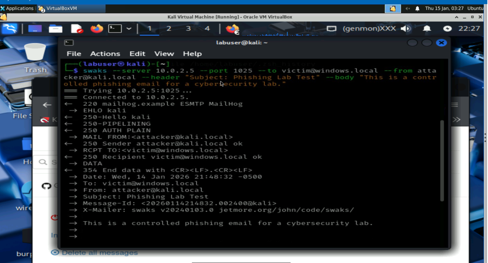
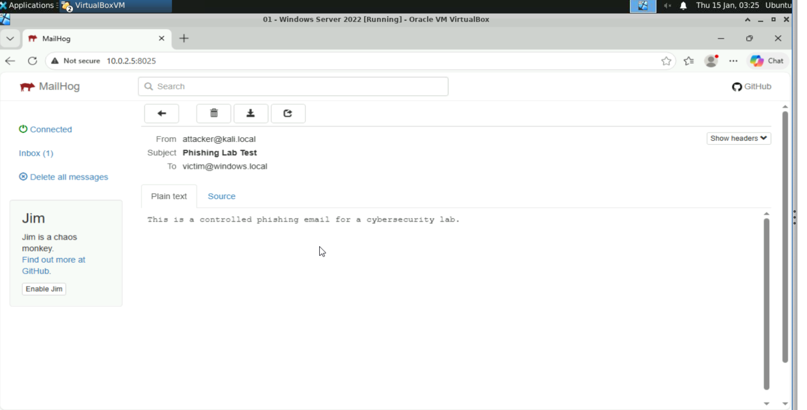
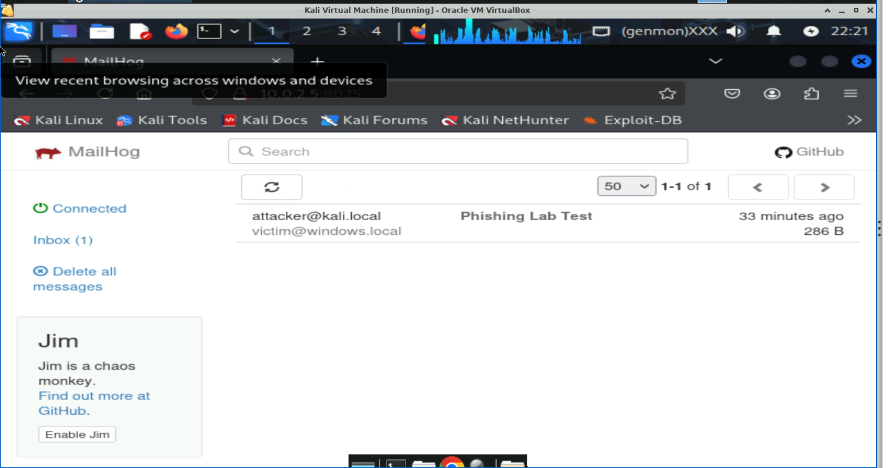

# Phishing-Simulation-Lab

## Overview
This project demonstrates how phishing emails are delivered and how organizations defend against them. The lab was conducted in a controlled virtual environment to simulate a real phishing scenario using the SMTP email protocol.
The goal of this project is to understand how phishing emails are sent, how attackers spoof sender identities, and how email authentication technologies such as SPF, DKIM, and DMARC help detect and prevent malicious emails.

## Lab Environment
The phishing simulation was performed in a controlled virtual lab environment using virtual machines.
Attacker system  
Kali Linux Virtual Machine
Victim system  
Windows Virtual Machine
Email testing server  
MailHog email testing server
The attacker system sends a phishing email using SMTP while MailHog captures the message so it can be analyzed safely.
The sender address attacker@kali.local represents a simulated attacker domain used only for testing inside the lab environment.

## Tools Used
Kali Linux  
MailHog Email Testing Server  
Virtual Machines  
SMTP Protocol
Swaks SMTP testing tool

## Phishing Attack Simulation
In this lab a phishing email was created and sent from the Kali Linux attacker virtual machine to the Windows victim virtual machine.
Instead of sending the email through real internet mail servers the email was captured by MailHog. This allows the phishing message to be viewed and analyzed without affecting real email systems.
The email was sent using SMTP which demonstrates how attackers can spoof sender identities and deliver phishing messages.

## Email Delivery Overview SMTP
SMTP stands for Simple Mail Transfer Protocol. It is the protocol responsible for sending emails between mail servers across the internet.
SMTP allows messages to be delivered but it does not verify the identity of the sender. Because of this limitation attackers can spoof email addresses and send phishing messages.
This is why additional email authentication controls such as SPF DKIM and DMARC are used.

## How SMTP Works
A user sends an email using an email client such as Gmail or Outlook.
The email client connects to an SMTP server.
The sending server looks up the recipient domain using DNS MX records.
The sending server connects to the recipient mail server.
The email is transmitted using SMTP commands.

## Email Authentication Controls

### SPF Sender Policy Framework
SPF verifies whether the sending mail server is authorized to send email on behalf of a domain.
The receiving server checks the sending server IP address against the domain SPF record stored in DNS.
If the IP address is authorized the email passes the SPF check. If not the email fails authentication.

### DKIM DomainKeys Identified Mail
DKIM uses a digital signature to verify that an email message has not been altered during transmission.
The receiving server retrieves the sender public key from DNS and verifies the email signature.

### DMARC Domain based Message Authentication Reporting and Conformance
DMARC builds on SPF and DKIM by defining how email servers should handle messages that fail authentication checks.
Depending on the domain policy emails may be delivered sent to spam or rejected.

## MailHog Email Capture
MailHog was used as a local email testing server to capture the phishing email sent from the Kali Linux attacker virtual machine.
MailHog allows emails to be safely captured and inspected without sending real phishing emails through external mail systems.
The MailHog web interface displays the captured message which allows analysis of the sender address message headers and email content.

## Screenshots
### 1. Sending the Phishing Email from Kali
This screenshot shows the attacker machine sending a phishing email using SMTP commands from the Kali Linux terminal.

### 2. MailHog Capturing the Email
MailHog captures the phishing email inside the lab environment before it reaches a real mail system.

### 3. Viewing the Phishing Email
The captured phishing email can be opened inside MailHog to inspect the message body and headers.

This lab demonstrates how attackers can exploit the SMTP protocol to spoof sender identities and deliver phishing emails. It also shows how security technologies such as SPF, DKIM, and DMARC help organizations detect and prevent email spoofing attacks. By capturing the message in MailHog, the phishing attempt can be analyzed safely without interacting with real email systems.

## Skills Demonstrated
Email security analysis  
Phishing attack simulation  
SMTP protocol understanding  
Threat analysis
Email authentication technologies SPF DKIM DMARC  
Cybersecurity lab documentation
